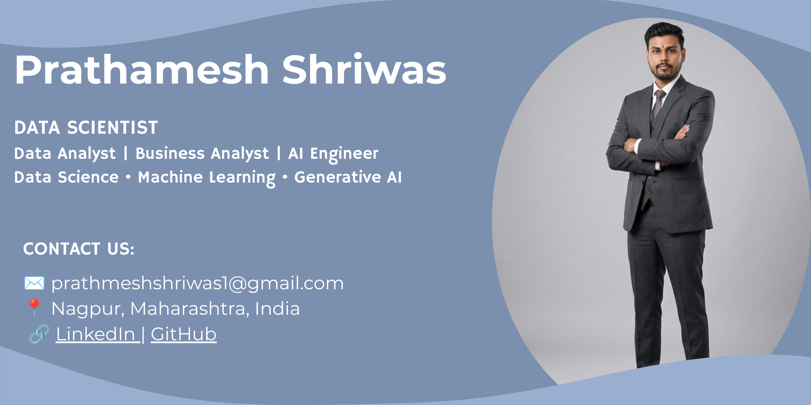

<!--Banner-->


<!--Night Owl image-->
<div>
  
</div>

<!--Header Name-->
#  ɪ'ᴍ Prathamesh Shriwas!
*Aspiring Data Scientist & AI Engineer*
<br />

<!--Start Intro-->
<p align="left">
I am a passionate <strong>Data Science Fellow</strong> and aspiring <strong>Data Analyst & AI Engineer</strong> with a strong interest in Machine Learning, Data Analytics, Artificial Intelligence, and real-world problem solving. I enjoy building intelligent systems, analyzing data, and creating impactful projects using Python, SQL, Power BI, and AI technologies.
</p>

- ✨ Student of life :)
- 🌱 Currently learning and improving my skills in Data Science, Machine Learning, and AI.
- 📊 Passionate about Data Analytics, Visualization, and AI-powered applications.
- 🤖 Exploring Machine Learning, Deep Learning, and Generative AI technologies.
- 💡 Interested in solving real-world business and healthcare problems using data.
- 🧠 Strong analytical thinking with engineering background.
- 💻 Working on Python, SQL, Power BI, Tableau, and Machine Learning projects.
- ☁ AWS Academy Graduate – AWS Cloud Foundations Certified.
- ❤ Love learning new technologies and contributing to projects.
- 📈 Goal: To become a successful Data Scientist & AI Engineer.

<!--End Intro-->

<!--Profile Count Badge-->
<p align="left">
  
</p>

---

<!--Languages and Tools Section-->
<h2 align="center">Tᴇᴄʜ Sᴛᴀᴄᴋ & Sᴋɪʟʟs</h2>

<p align="center">
  
</p>

<br />

<h3 align="left">🧠 Data Science & AI Skills</h3>

<ul align="left">
  <li><strong>Programming:</strong> Python, SQL</li>
  <li><strong>Data Analysis:</strong> Pandas, NumPy, Data Cleaning, EDA, Data Visualization</li>
  <li><strong>Visualization Tools:</strong> Power BI, Tableau, Matplotlib, Seaborn</li>
  <li><strong>Machine Learning:</strong> Scikit-Learn, Regression, Classification, Clustering</li>
  <li><strong>Deep Learning:</strong> Neural Networks, TensorFlow, PyTorch Basics</li>
  <li><strong>Databases:</strong> MySQL</li>
  <li><strong>Cloud:</strong> AWS Cloud Foundations</li>
  <li><strong>Other Skills:</strong> Workflow Optimization, Problem Solving, Analytical Thinking</li>
</ul>

---

<h3 align="left">📚 Current Learning</h3>

<ul align="left">
  <li>Advanced Data Analytics & Machine Learning</li>
  <li>Deep Learning & Generative AI</li>
  <li>Power BI Dashboards & Business Intelligence</li>
  <li>SQL Optimization & Data Engineering Concepts</li>
  <li>Real-world AI and Healthcare Analytics Projects</li>
</ul>

---

<!--Projects Section-->
<h2 align="center">🚀 Projects</h2>

<h3>📊 Visa Approval Analytics Dashboard</h3>

<ul>
  <li>Built an end-to-end Data Analytics project using <strong>Python, SQL Server, Machine Learning, and Power BI</strong>.</li>
  <li>Analyzed <strong>25,480 visa applications</strong> to identify factors influencing visa certification and denial outcomes.</li>
  <li>Performed <strong>Data Cleaning, Exploratory Data Analysis (EDA), and Business Insights Generation</strong>.</li>
  <li>Developed SQL queries for approval trends, wage analysis, education analysis, and regional insights.</li>
  <li>Built and evaluated Machine Learning models including <strong>Logistic Regression, Decision Tree, and Random Forest</strong>.</li>
  <li>Designed a professional <strong>3-page Power BI Dashboard</strong> featuring Executive Summary, Applicant Analysis, and Business Insights.</li>
  <li>Generated actionable recommendations based on wage, education, experience, and regional factors.</li>
  <li>Tech Stack: <strong>Python, Pandas, NumPy, Matplotlib, Seaborn, SQL Server, Scikit-Learn, Power BI, GitHub</strong>.</li>
</ul>

<h3>⚡ Smart Energy Consumption Analysis</h3>

<ul>
  <li>Analyzed electrical parameters like voltage, current, and power using Python.</li>
  <li>Used Pandas for data preprocessing and statistical analysis.</li>
  <li>Implemented threshold-based logic for abnormal condition detection.</li>
  <li>Visualized energy consumption patterns using Matplotlib.</li>
</ul>

<h3>🏥 Healthcare Python Projects</h3>

<ul>
  <li>Hospital Patient Record System</li>
  <li>Medicine Reminder Program</li>
  <li>Health Risk Checker</li>
</ul>

<h3>🎓 Student Grade Calculator</h3>

<ul>
  <li>Built a logic-based grading system using Python conditional statements.</li>
</ul>

<!--Tech Stack-->
<h2 align="center">⚙️ Technologies & Tools</h2>

<p align="center">


</p>

---

<!--Github stats Table-->
<h2 align="center">📊 GitHub Stats</h2>

<table width="100%">
  <tr>
    <td width="50%">
      
    </td>

    <td width="50%">
      
    </td>
  </tr>
</table>

<p align="center">
  
</p>

---

<!--Trophies Section-->
<h2 align="center">🏆 GitHub Trophies</h2>

<p align="center">
  
</p>

---

<!--Thought of the Day-->
<h2 align="center">🌟 Thought of the Day 🌟</h2>

<p align="center">
  
</p>

---

<!--Contact Section-->
<h2 align="center">🤝 Connect With Me 🤝</h2>

<div align="center">

<a href="mailto:prathameshshriwas22@gmail.com" target="_blank">

</a>

<a href="https://www.linkedin.com/in/prathamesh-shriwas-32662b2b7" target="_blank">

</a>

<a href="https://github.com/PrathameshShriwas" target="_blank">

</a>

</div>

<br />


<!--Footer-->
<p align="center">
  
</p>
```
